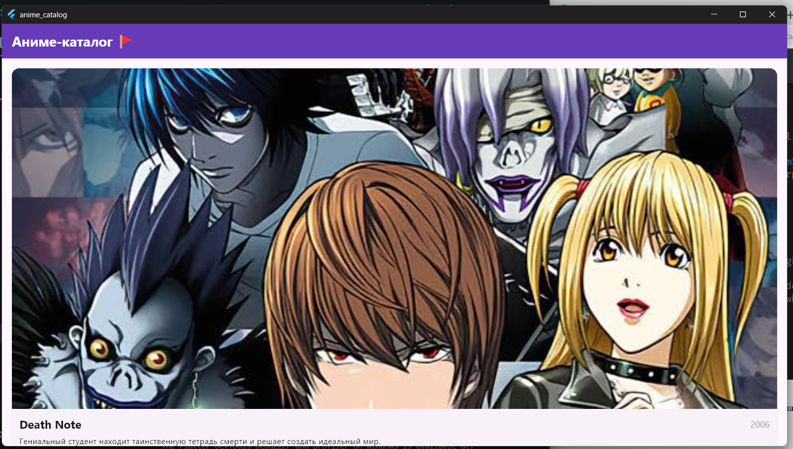

# Лабораторная работа №4 — Flutter: списки, модели данных и карточки

**Выполнил:** Плеско Д.Д. 
**Группа:** ИСП-231  
**Дата сдачи:** 28.04.2026

---

## Что изучили

1. **Создание модели данных** — научились создавать Dart-классы с `final` полями и `const` конструктором для хранения структурированных данных (класс `Anime`).
2. **Виртуализация списков** — использовали `ListView.builder` для эффективного отображения большого количества элементов (создаются только видимые на экране).
3. **Переиспользуемые виджеты** — вынесли карточку аниме в отдельный виджет `AnimeCard`, который можно использовать многократно с разными данными.
4. **Работа с темой Material Design** — настроили глобальную тему приложения через `ThemeData` и `ColorScheme.fromSeed()`.
5. **Git и GitHub** — научились инициализировать репозиторий, коммитить изменения и пушить проект на GitHub.

---

## Скриншот финального приложения



---

## Инструкция по запуску

1. Убедитесь, что установлен Flutter SDK (версия 3.x или новее).
2. Клонируйте репозиторий:
```bash
git clone <URL_вашего_репозитория>
```
3. Перейдите в папку проекта:
```bash
cd anime_catalog
```
4. Установите зависимости:
```bash
flutter pub get
```
5. Запустите приложение в браузере Chrome:
```bash
flutter run -d chrome
```
6. Для запуска на других устройствах выполните flutter devices и выберите нужное устройство.